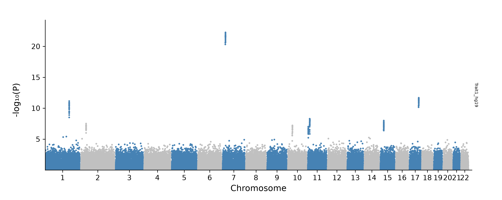

.. _cli_tutorial:

CLI Tutorial
============

This tutorial is an end-to-end walkthrough of every user-facing feature
in **pycmplot** from the *command line*, working from the same synthetic
dataset throughout so that every command is directly copy-pasteable.
It's longer and more granular than :ref:`quickstart` — read the
quickstart first if you just want to see the shape of the CLI in a page.

Looking for the equivalent Python-API walkthrough?  See
:ref:`python_api_tutorial` — it covers the same features using the
``pcm.prep`` / ``pcm.load`` / ``pcm.linear`` / ``pcm.circular``
functions in a runnable Jupyter notebook.

The tutorial is organised as a progression:

#. :ref:`cli-tut-setup` — a synthetic sumstats file you can paste-and-run.
#. :ref:`cli-tut-load` — the three-step load / prep / plot mental model.
#. :ref:`cli-tut-linear` — single- and multi-track linear Manhattan plots.
#. :ref:`cli-tut-circular` — the Circos-style circular layout.
#. :ref:`cli-tut-highlight` — thresholds, colours, and highlight controls.
#. :ref:`cli-tut-annotate` — automatic nearest-gene labels and the hits table.
#. :ref:`cli-tut-qq` — QQ plots and the ``compute_pvals`` opt-in.
#. :ref:`cli-tut-cache` — the per-track cache and warm-resume behaviour.
#. :ref:`cli-tut-overlay` — the user-editable hits-overlay TSV.
#. :ref:`cli-tut-colors` — per-locus highlight colours.
#. :ref:`cli-tut-categories` — per-locus categories and the custom legend.
#. :ref:`cli-tut-multipanel` — multiple sumstats groups on one canvas.
#. :ref:`cli-tut-liftover` — mixed genome builds.
#. :ref:`cli-tut-editor` — browser-based GUI for editing the hits overlay.
#. :ref:`cli-tut-cli` — CLI equivalents for every step above.
#. :ref:`cli-tut-faq` — troubleshooting and common gotchas.

.. _cli-tut-setup:

Setup: a synthetic dataset
--------------------------

Every CLI invocation below assumes six synthetic sumstats files on
disk (``trait{1..6}.tsv.gz``). Download the python script used for benchmark 
`here`_ and run it as shown below.

.. _here: https://github.com/esohkevin/pycmplot/blob/main/benchmark/generate_sumstats.py

The code below generates six sumstats, ``triat1`` to ``trait6``, each containing 
1 million SNPs. Traits 1 to 3 are in hg19 coordinate while traits 4 to 6 are 
in hg38 coordinate. All the files are gzipped and saved in the folder ``data``.
The ``--targets auto`` option injects 6 significant loci on chr3, chr6, chr11, 
chr13, chr18, and chr20 in all sumstats, 2 significant loci specific to hg19 sumstats 
(in chr2 and chr15) and 2 significant loci specific to hg38 sumstats (in chr12 and chr16). 
These are actuall **body height** significant loci pulled from `GWAS Catalog`_.

.. _GWAS Catalog: https://www.ebi.ac.uk/gwas/efotraits/OBA_VT0001253

.. code-block:: bash
   HG19_TARGET_SPIKES: list[tuple[str, int, float]] = [
      ("3",  72_392_645,  1e-50),   # rs4677148
      ("2",  36_733_328,  3e-08),   # rs2030645 - hg19-specific
      ("7",  18_786_817,  7e-23),   # rs727851
      ("10", 31_127_166,  7e-08),   # rs12413361
      ("11", 12_879_123,  5e-09),   # rs546512774
      ("11", 2_802_090,   9e-08),   # rs234886
      ("15", 22_791_431,  1e-08),   # rs6606792 - hg19-specific
      ("17", 59_498_250,  1e-41),   # rs9905385
   ]

   HG38_TARGET_SPIKES: list[tuple[str, int, float]] = [
      ("3",  72_343_494,  1e-50),   # rs4677148
      ("7",  18_747_194,  7e-23),   # rs727851
      ("10", 30_838_237,  7e-08),   # rs12413361
      ("11", 12_857_576,  5e-09),   # rs546512774
      ("11", 2_780_860,   9e-08),   # rs234886
      ("12", 122_933_684, 7e-09),   # rs73230017 - hg38-specific
      ("16", 69_181_056,  1e-08),   # rs12444184 - hg38-specific
      ("17", 61_420_889,  1e-41),   # rs9905385
   ]

.. code-block:: bash

   for i in {1..3}; do
      python generate_sumstats.py \
         --n 1000000 \
         --build hg19 \
         --targets auto \
         --out ./data/sumstats_1M_trait${i}_hg19.tsv.gz
   done

   for i in {4..6}; do
      python generate_sumstats.py \
         --n 1000000 \
         --build hg38 \
         --targets auto \
         --out ./data/sumstats_1M_trait${i}_hg38.tsv.gz
   done

Use ``python generate_sumstats.py -h`` to see all options.

.. note::
   The six sumstats files are created with a ``BUILD`` column. To demonstrate 
   the use of the ``--build`` option, we will create two more sumstats by 
   deleting the build columns from two of the sumstats already generated. 
   One in hg19 and one in hg38.

.. code-block:: bash
   gunzip -c ./data/sumstats_1M_trait1_hg19.tsv.gz | \
   rev  | \
   cut -f2- | \
   rev | \
   gzip -c > ./data/sumstats_1M_trait7_hg19.tsv.gz

   gunzip -c ./data/sumstats_1M_trait4_hg19.tsv.gz | \
   rev  | \
   cut -f2- | \
   rev | \
   gzip -c > ./data/sumstats_1M_trait8_hg38.tsv.gz

.. _cli-tut-load:

The CLI mental model
--------------------

Every ``pycmplot`` invocation performs the same three steps internally
— column resolution, data loading (+ optional liftover, lead extraction,
hits-table construction), and rendering.  From the CLI you don't have
to think about them separately: one command runs the whole pipeline
and writes the output image(s) plus a locus summary TSV.

The canonical minimum invocation is:

.. code-block:: bash

   pycmplot \
     --sum_stats ./data/sumstats_1M_trait1_hg19.tsv.gz \
     --labels Trait1 \
     --logp \
     --output_dir ./out

This defaults to a linear Manhattan plot for ``./data/sumstats_1M_trait1_hg19.tsv.gz`` 
file, with p-values shown as ``-log10(P)``, written into ``./out/``.  
The rest of this tutorial adds one feature at a time on top of that base.

.. _cli-tut-linear:

Linear Manhattan plots
----------------------

Single-track
~~~~~~~~~~~~

.. code-block:: bash

   pycmplot \
     --sum_stats hb.tsv --labels Hb \
     --logp \
     --colors steelblue,silver \
     --plot_title "Hb" \
     --output_dir ./out --output_format png --dpi 300

Multi-track
~~~~~~~~~~~

Passing more than one sumstats file stacks the tracks vertically, one
axes per file, sharing the chromosomal x-axis.  Files and labels are
comma-separated, in matching order:

.. code-block:: bash

   pycmplot \
     --sum_stats hb.tsv,mcv.tsv \
     --labels Hb,MCV \
     --logp --trim_pval 0.01 \
     --colors steelblue,silver \
     --output_dir ./out

Colour scheme is applied per chromosome (alternating), not per track,
matching classic Manhattan convention.

.. _cli-tut-circular:

Circular (Circos) plots
-----------------------

Add ``--mode cm`` (circular) to switch layout — everything else stays
the same:

.. code-block:: bash

   pycmplot \
     --sum_stats hb.tsv,mcv.tsv \
     --labels Hb,MCV \
     --mode cm \
     --logp --trim_pval 0.01 \
     --colors steelblue,silver \
     --plot_title "RBC Traits" \
     --output_dir ./out

The default ``--mode lm`` (linear Manhattan) is what every earlier
command has been using implicitly.

.. _cli-tut-highlight:

Highlighting
------------

Add ``--highlight`` to colour signals above a threshold, and
``--signif_line`` to draw a horizontal cut-off line at that threshold:

.. code-block:: bash

   pycmplot \
     --sum_stats hb.tsv,mcv.tsv --labels Hb,MCV \
     --logp --trim_pval 0.01 \
     --highlight --signif_line \
     --highlight_color brown \
     --signif_threshold 5e-8 \
     --output_dir ./out

The default highlight colour applies to every hit unless a specific
locus has been given a custom colour in the hits overlay
(see :ref:`cli-tut-colors`).

.. _cli-tut-annotate:

Automatic gene annotation
-------------------------

Add ``--annotate GENE`` to label each lead SNP with its nearest
gene, and optionally ``--label_col top_gene`` to control which
column from the hits table is used as the label:

.. code-block:: bash

   pycmplot \
     --sum_stats hb.tsv,mcv.tsv --labels Hb,MCV \
     --logp --trim_pval 0.01 \
     --highlight --annotate GENE --label_col top_gene \
     --output_dir ./out

The hits summary table written alongside the plot is a tidy CSV/TSV
you can inspect or export directly:

Any of ``--annotate SNP`` (label with rsID),
``--annotate GENE`` (label with the nearest / top gene), or a
column name from the hits table is accepted.  Add
``--annotate GENE`` on top of the previous command:

.. code-block:: bash

   pycmplot \
     --sum_stats hb.tsv,mcv.tsv --labels Hb,MCV \
     --logp --trim_pval 0.01 \
     --highlight --signif_line --annotate GENE \
     --output_dir ./out

Every run also writes a locus summary TSV to ``--output_dir``.
Inspect it with any TSV viewer:

.. code-block:: bash

   head out/*.tsv
   # CHR   POS       SNP    P              LABEL   top_gene   source
   # 1     14822344  rs123  3.4e-11        Hb      FTO        auto

Columns include ``CHR``, ``POS``, ``SNP``, ``P``, ``LABEL``
(track name), ``top_gene``, plus the overlay columns
``source``, ``highlight_color``, and ``category`` (introduced by the
overlay system — see :ref:`cli-tut-overlay`).

Distance semantics
~~~~~~~~~~~~~~~~~~

Every distance-based field on the hits table
(``nearest_gene_distance``, ``upstream_distance``,
``downstream_distance``, and the numeric part of the intergenic
``top_gene`` label) is computed against the **near edge of the gene
body**, not the TSS.  Concretely:

* ``nearest_upstream_gene`` — the closest gene whose ``END < POS``,
  measured as ``POS − END`` (the SNP's distance to the gene's right
  edge, which for a left-flanker is the edge facing the SNP).
* ``nearest_downstream_gene`` — the closest gene whose ``START > POS``,
  measured as ``START − POS``.
* ``nearest_gene`` — the closest gene by ``min(|POS − START|, |POS − END|)``,
  regardless of which side of the SNP it sits on; ``0`` when the SNP
  falls inside a gene body (``genic = True``).

This convention is deliberately **strand-blind**.  It matches what
``bedtools closest``, VEP's "nearest gene" annotation, and ANNOVAR's
``gene_dist`` column report, so pycmplot's numbers line up directly
with those tools.  A gene whose body extends toward the SNP wins its
side even when a more compact gene sits closer to the SNP's
mid-point — the near-edge rule is what makes the answer independent
of gene length.

The **only** field where strand still matters is
``promoter_upstream_flag``, which uses a 2 kb window
5' of each gene's TSS (``[START − 2 kb, START)`` for ``+`` strand,
``(END, END + 2 kb]`` for ``−`` strand).  That's genuinely a
biological concept and would be misleading if computed positionally,
so it stays strand-aware.

See the manuscript's :download:`annotation_schematic.pdf
<../benchmark/figures/annotation_schematic.pdf>` for a visual
walkthrough of the near-edge rule under different gene layouts.

.. rubric:: In one paragraph

Left/right flanker selection is a pure coordinate comparison: a gene
enters ``nearest_upstream_gene`` iff its body ends at a lower
coordinate than the SNP (``END < POS``, so the whole body sits on
the numerically-lower side) and ``nearest_downstream_gene`` iff it
starts at a higher one (``START > POS``); on each side the winner is
the gene whose near edge (``END`` for the left flanker, ``START`` for
the right) minimises the base-pair gap to the SNP.  This is
strictly *orientational* — a statement about where the gene body
sits on the coordinate axis relative to the SNP — and does not
reference the gene's strand; two genes with identical coordinates
but opposite strands would be classified identically.  The one
place strand is retained is
:data:`promoter_upstream_flag`, which is set when the SNP falls in
the 2 kb window immediately 5' of any gene's TSS —
``[START − 2 kb, START)`` for ``+`` strand genes and
``(END, END + 2 kb]`` for ``−`` strand genes.  "Promoter" is a
genuinely biological concept defined relative to transcription
direction, so it is the only field where strand information matters.

.. _cli-tut-qq:

QQ plots and ``compute_pvals``
------------------------------

The loader normally skips materialising the full sorted p-value
array (~80 MB per track at 10 M variants) because most users never
draw a QQ plot.  The CLI ``--qq_plot`` flag turns that computation on
automatically — you never need to think about the underlying
``compute_pvals`` parameter:

.. code-block:: bash

   pycmplot \
     --sum_stats hb.tsv,mcv.tsv --labels Hb,MCV \
     --logp --trim_pval 0.01 \
     --qq_plot \
     --output_dir ./out

QQ layout is chosen by additional flags on top of ``--qq_plot``:

.. code-block:: bash

   # A grid of per-track QQ panels (default)
   pycmplot --sum_stats hb.tsv,mcv.tsv --labels Hb,MCV --logp --qq_plot \
            --qq_ncols 2 --output_dir ./out

   # All tracks overlaid on one axes, coloured by label
   pycmplot --sum_stats hb.tsv,mcv.tsv --labels Hb,MCV --logp --qq_plot \
            --qq_overlay --output_dir ./out

   # One QQ image per track
   pycmplot --sum_stats hb.tsv,mcv.tsv --labels Hb,MCV --logp --qq_plot \
            --qq_separate --output_dir ./out

Every layout draws the 95% CI band around the diagonal and annotates
each track with its genomic inflation factor λ.  The CI band is not
in the legend — it's visually self-evident, and removing it keeps
the top corner uncluttered.

.. _cli-tut-cache:

Caching and warm resume
-----------------------

Loading is the expensive step (I/O + trim + liftover + lead
extraction).  Turn on caching and every re-run of the same
``(files, parameters)`` combination completes in milliseconds:

.. code-block:: bash

   pycmplot \
     --sum_stats hb.tsv,mcv.tsv --labels Hb,MCV \
     --logp --trim_pval 0.01 --highlight \
     --cache \
     --cache_dir ./.pycmplot \
     --output_dir ./out

Resume is enabled by default; add ``--no_resume`` to force
regeneration while still writing fresh entries.

**How keying works.** Each track gets a cache entry keyed on
``SHA-256(raw_file_sha256 + cache_version + Stage-1 params)``.  If any
of those change — you re-genotype and re-run, or you bump
``highlight_thresh`` — the affected tracks silently regenerate and
the rest are reused.  There are no stale-cache accidents.

**Cache layout** (rooted at ``cache_dir``):

.. code-block:: text

   .pycmplot/
   ├── tracks/
   │   ├── Hb.<key>.parquet         # loaded rows
   │   ├── Hb.<key>.leads.parquet   # per-track hits
   │   ├── Hb.<key>.pvals.npz       # sorted float32 pvals (only if compute_pvals=True)
   │   └── Hb.<key>.meta.json
   └── annotations/
       └── hits.<group_key>.tsv     # merged hits overlay (see next section)

**Disabling resume.** ``resume=False`` forces regeneration but still
writes the fresh entries to disk (useful for benchmarking or after
you've bumped ``CACHE_VERSION`` upstream).

**Clearing the cache.** Delete ``cache_dir`` on the filesystem, or
use ``pycmplot --clear_cache --cache_dir ./.pycmplot`` from the CLI.

.. _cli-tut-overlay:

The hits overlay TSV
--------------------

When caching is enabled, the loader writes the hits table to a
group-scoped TSV that **you're expected to hand-edit**.  The path is:

.. code-block:: text

   <cache_dir>/annotations/hits.<group_key>.tsv

where ``group_key`` is a short SHA-256 of the sorted list of per-track
cache keys — so distinct ``(files, parameters)`` combinations get
distinct overlay files and never clobber each other, even on the same
canvas.

Every row starts with ``source='auto'`` (populated from the sumstats)
and three overlay columns you can edit:

.. code-block:: text

   # pycmplot hits overlay
   # Edit any row's highlight_color / category to customise the plot.
   # source=user rows are added by you; source=auto rows come from the loader.
   CHR  POS       SNP    P        LABEL  top_gene  source  highlight_color  category
   1    14822344  rs123  3.4e-11  Hb     FTO       auto    auto             significant
   2    91344001  rs456  2.1e-10  Hb     MYADM     auto    auto             significant
   ...

You can:

- **Edit ``highlight_color``** to give any locus its own colour
  (see :ref:`cli-tut-colors`).
- **Edit ``category``** to give any locus a legend label
  (see :ref:`cli-tut-categories`).
- **Add rows with ``source=user``** to force annotation of loci that
  didn't make the automatic cutoff.

**Persistence across cache regenerations.**  When Stage-1 parameters
change and auto rows are re-derived, your custom values are inherited
by ``(CHR, POS)`` lookup — you don't have to also change
``source='auto'`` to ``user`` to keep your edits.

.. _cli-tut-colors:

Per-locus highlight colours
---------------------------

Set the ``highlight_color`` column on any row to a matplotlib-parseable
colour (name, ``#rrggbb`` hex, or an ``(r, g, b)`` tuple):

.. code-block:: text

   CHR  POS       ...  source  highlight_color  category
   1    14822344  ...  auto    red              significant
   2    91344001  ...  auto    #00cc44          significant
   3    50000000  ...  auto    auto             significant  # falls back to default

The sentinel ``auto`` (or blank / NaN / invalid) falls back to the
plot-time ``highlight_color`` argument.  Invalid colours emit a
warning naming the offending value so typos are easy to fix.

Matching is done by nearest-lead within 500 kb on the same
chromosome, so re-running with a different thinning or trim never
loses your colour choices.

.. _cli-tut-categories:

Per-locus categories and the custom legend
------------------------------------------

The ``category`` column lets you group loci in the legend:

.. code-block:: text

   CHR  POS       ...  highlight_color  category
   1    14822344  ...  red              novel
   2    91344001  ...  #00cc44          replicated
   3    50000000  ...  auto             significant

**Both the linear and circular plotters** render a "Highlighted
Categories" legend with one entry per unique category in
first-appearance order — reorder your rows in the TSV to reorder the
legend.  When everything is left at defaults (all rows
``category=significant`` and ``highlight_color=auto``), **no legend
is added**, preserving the pre-feature layout.

Same-category-different-colour is deduplicated: the first colour
wins and a warning names the loser so you can fix the conflict.

Missing columns (e.g. loading a legacy cache) are tolerated — the
helper simply returns no legend entries in that case.

.. _cli-tut-multipanel:

Multi-panel canvas
------------------

Multi-panel canvases — where each panel is its own stacked linear (or
circular) sub-plot — are a **Python API** feature.  The CLI produces
one figure per invocation; if you need multiple sumstats groups laid
out on the same canvas (e.g. Hb on top, MCV on bottom, sharing a
title and legend), use the notebook workflow described in
:ref:`python_api_tutorial` under "Multi-panel canvas".  Every cache
file, hits overlay, per-locus colour, and category legend is
*group-scoped* under both interfaces, so two panels with different
sumstats never clobber each other's artefacts.

.. _cli-tut-liftover:

Mixed genome builds
-------------------

If your files were generated on different reference panels, pycmplot
can lift over hg18 and hg19 coordinates to hg38 before plotting.
Supply the per-file builds via a comma-separated ``--build`` list in
the same order as ``--sum_stats``:

.. code-block:: bash

   pycmplot \
     --sum_stats study_hg18.tsv,study_hg19.tsv,study_hg38.tsv \
     --labels A,B,C \
     --build hg18,hg19,hg38 \
     --logp --trim_pval 0.01 \
     --output_dir ./out

Alternatively, put a ``BUILD`` column in each file (with per-row
values ``hg18`` / ``hg19`` / ``hg38``) and omit ``--build`` — pycmplot
will auto-detect the column.  For the awkward case where one file
has a non-standard build column name (say ``my_build``), a single
``--build`` entry can carry a column reference:

.. code-block:: bash

   pycmplot \
     --sum_stats a.tsv,b.tsv,c.tsv --labels A,B,C \
     --build hg19,hg38,col:my_build \
     --logp --output_dir ./out

``col:<colname>`` (or bare ``col``, which auto-detects using the
standard candidate list ``BUILD`` / ``Genome`` / ``Genome_Build`` /
``Genome-build``) says "for this file, source per-row builds from
the named column".

Liftover is cached alongside the loaded rows, so subsequent runs
(with ``--cache``) skip it entirely.

.. _cli-tut-editor:

GUI editor for the hits overlay
-------------------------------

If hand-editing the ``hits.<group>.tsv`` in a text editor feels
awkward — especially picking colours by typing hex codes — pycmplot
ships an optional browser-based editor.  Install the extra and launch
it against your cache directory:

.. code-block:: bash

   pip install "pycmplot[editor]"
   pycmplot edit --cache_dir ./.pycmplot_cache

That opens a local Streamlit app (default ``http://localhost:8501``)
with a spreadsheet-style view of the overlay.  Highlights of the UI:

* ``source``, ``highlight_color``, and ``category`` are rendered as
  typed columns — ``source`` is a dropdown of ``auto`` / ``user``;
  ``category`` is a selectbox pre-populated with every category
  already in use (type a new value to add it).
* Rows can be added or deleted inline for ``source='user'`` loci
  that didn't make the automatic cutoff.
* A "Colour preview" strip below the table shows each row as a
  labelled swatch — valid colours render at their true colour;
  ``auto`` renders as a dashed grey chip; invalid values render red
  so typos are impossible to miss.
* **Save** writes through the same :func:`~pycmplot.cache.write_hits_overlay`
  the loader uses, so atomic writes and inheritance-across-regenerations
  behave identically to the text-editor workflow.
* **Preview plot** re-renders a linear Manhattan against the cached
  tracks and the *in-memory* overlay, so you can see colour /
  category changes reflected before saving.
* **Discard & reload** drops unsaved changes and re-reads the TSV.

When the cache directory contains multiple ``hits.<group>.tsv`` files
(different ``(files, parameters)`` combinations sharing one
``cache_dir``), the editor prints the available group keys and asks
you to re-launch with ``--group <key>``.  Full flag list:

.. code-block:: text

   pycmplot edit --cache_dir PATH  [--group KEY] [--host HOST] [--port PORT] [--tui]

The extra is opt-in so headless / CI pipelines don't pay the
Streamlit install cost.

Terminal-UI backend for cluster sessions
~~~~~~~~~~~~~~~~~~~~~~~~~~~~~~~~~~~~~~~~

Many clusters (secured HPC facilities, hospital compute, etc.) don't
allow port forwarding or run headless compute nodes without a graphical
display — the browser editor is unusable there.  For those cases,
pycmplot ships a **terminal UI** built on `Textual
<https://textual.textualize.io/>`_ that renders in any ANSI terminal
and needs nothing more than a plain SSH session:

.. code-block:: bash

   pip install "pycmplot[editor-tui]"
   pycmplot edit --cache_dir ./.pycmplot_cache --tui

The TUI has feature parity with the browser backend, adjusted for
keyboard-only ergonomics:

* Spreadsheet-style ``DataTable`` — arrow keys / Home / End / PgUp /
  PgDn to navigate; **F2** or **Enter** to open the cell-edit modal.
* The modal opens with the current value pre-selected so typing
  replaces; a live colour swatch renders the resolved colour in
  truecolor if your terminal supports it, and invalid values render
  with a red frame so typos are caught before save.
* Category cells show existing labels as a hint line — copy-paste to
  reuse or type a new value to add.
* Footer bindings: **Ctrl+S** save, **Ctrl+R** reload (prompts if
  dirty), **Ctrl+N** add ``source=user`` row, **Ctrl+D** delete row,
  **Ctrl+P** render a preview PNG to ``<cache_dir>/preview.png``
  (most terminals can't render images inline), **Ctrl+Q** quit
  (prompts if dirty).
* Save delegates to the same
  :func:`~pycmplot.cache.write_hits_overlay` the browser backend
  uses, so atomic-write + inheritance guarantees hold identically.

The two backends are independent extras — install just the one you
need, or both.  A vanilla ``pip install pycmplot`` still pulls
neither.

Filter, multi-select, and batch edit (TUI)
""""""""""""""""""""""""""""""""""""""""""

For overlays with dozens to hundreds of loci, single-cell editing is
tedious.  The TUI adds a filter + multi-select + batch-edit flow:

* Press ``/`` to open a filter modal.  Type any pandas
  :meth:`~pandas.DataFrame.query` expression — ``P < 5e-8``,
  ``category == "significant"``, ``CHR == "6" and BP.between(28e6, 34e6)``.
  The grid re-renders showing only matching rows; ``Esc`` clears the
  filter (and any selection) in one keystroke.
* Press ``Space`` on a row to toggle its selection (visible as a
  green ● in the leftmost ✓ column).  Selection is tied to the
  *original* dataframe index so it survives filtering and refresh.
* Press ``Ctrl+A`` to select every row currently visible under the
  filter.  ``/ P < 5e-8`` then ``Ctrl+A`` is the standard
  "select every genome-wide hit" move.
* Press ``Ctrl+E`` to open the batch-edit modal.  Toggle between the
  ``highlight_color`` and ``category`` columns, type one value, and
  it's applied to every selected row.  The colour swatch preview
  and validation are identical to the single-cell modal.  When no
  rows are explicitly selected, batch-edit falls back to "the
  current filtered view" — so ``/ … Ctrl+E`` is a two-step batch
  flow.

Batch CLI (``pycmplot hits``)
~~~~~~~~~~~~~~~~~~~~~~~~~~~~~

For pipelines, Makefiles, and reproducible analysis notebooks, a
scripted "colour every genome-wide-significant novel hit red" step
belongs in code rather than a GUI.  The ``pycmplot hits``
subcommand exposes the same filter grammar in a batch CLI:

.. code-block:: bash

   # Preview what would change
   pycmplot hits set                                        \
       --cache_dir ./.pycmplot_cache                        \
       --where 'P < 5e-8'                                   \
       --color '#00cc44' --category "genome-wide"           \
       --dry-run

   # Actually apply
   pycmplot hits set                                        \
       --cache_dir ./.pycmplot_cache                        \
       --where 'P < 5e-8'                                   \
       --color '#00cc44' --category "genome-wide"

   # Inspect the overlay
   pycmplot hits list                                       \
       --cache_dir ./.pycmplot_cache                        \
       --where 'category == "novel"'                        \
       --columns CHR,POS,SNP,P,category

   # Pipe TSV output to awk / cut / etc.
   pycmplot hits list --cache_dir ./.pycmplot_cache --tsv \
       | awk -F'\\t' 'NR > 1 && $4 < 5e-8 {print $3}'

``--where`` uses pandas' :meth:`~pandas.DataFrame.query` grammar —
identical to the TUI's filter, so users learn one syntax.  Invalid
colours are rejected pre-write; a bad ``--where`` expression prints
the offending part rather than a pandas traceback.  ``--dry-run``
prints the N rows that would change and exits without touching
disk.  Writes go through the same :func:`~pycmplot.cache.write_hits_overlay`
path as every other backend — atomic writes and inheritance
guarantees apply identically.

The CLI needs no extras — no Streamlit, no Textual — just the base
package.  Ideal for a headless CI step that reproducibly applies a
colouring policy without any interactive editing.

.. _cli-tut-cli:

CLI equivalents
---------------

Everything above has a CLI equivalent.  A representative one-liner:

.. code-block:: bash

   pycmplot \
     --sum_stats hb.tsv,mcv.tsv \
     --labels Hb,MCV \
     --logp --signif_line --highlight \
     --annotate GENE \
     --trim_pval 0.01 \
     --cache --cache_dir ./.pycmplot \
     --output_dir ./out

Cache flags (all mirror the Python API):

- ``--cache`` — enable caching + hits overlay.
- ``--cache_dir PATH`` — where to store artefacts (default ``./.pycmplot``).
- ``--no_resume`` — regenerate everything but still write fresh entries.
- ``--clear_cache`` — delete the cache tree and exit.
- ``-qq / --qq_plot`` — implies ``compute_pvals=True`` under the hood.
- ``-V / --version`` — print version and exit.

See :ref:`cli` for the full reference.

.. _cli-tut-faq:

Troubleshooting
---------------

**QQ plot fails with** ``bundle['pvals']`` **being** ``None``
   You forgot to pass ``compute_pvals=True`` to the loader (see
   :ref:`cli-tut-qq`).  The default flipped from ``True`` to ``False``
   in 0.4.0 to avoid the ~80 MB-per-track memory cost when you're
   not making QQ plots.

**Cache says HIT for track A but MISS for track B on a warm re-run**
   Almost always means Stage-1 parameters differ between the two
   tracks (e.g. ``signif_threshold`` was auto-computed for one but
   explicitly set for the other).  Explicitly pass every Stage-1
   parameter you care about to lock in reproducibility.

**Hex colours in my TSV are being truncated / dropped**
   Don't use ``pd.read_csv(comment='#')`` to inspect the overlay —
   it treats ``#`` mid-cell as a comment marker and eats hex-color
   values.  The pycmplot reader strips only leading ``#`` header
   lines; if you inspect the file yourself, strip leading ``#`` lines
   manually and then read as a plain TSV.

**Highlight legend didn't appear**
   :func:`~pycmplot.annotation.build_highlight_legend_entries` returns
   an empty list when everything is at defaults
   (``category=significant`` for all rows AND ``highlight_color=auto``
   for all rows) — the plotter then skips the legend to preserve the
   pre-feature layout.  Edit at least one row's ``category`` or
   ``highlight_color`` to trigger it.

**"Category X appears with multiple colours" warning**
   You set two loci to the same ``category`` but gave them different
   ``highlight_color`` values.  The first colour wins in the legend;
   the warning names the value that lost so you can fix the TSV.

**Multi-panel run overwrote another panel's hits overlay**
   This shouldn't happen from 0.4.0 onward — each ``(files,
   parameters)`` group gets its own ``hits.<group_key>.tsv``.  If
   you see it, check that you're really passing distinct
   ``sum_stats`` lists to each panel's loader call.

**Hits overlay TSV got corrupted (crash mid-save, truncated line, etc.)**
   The loader logs ``"Hits overlay unreadable (…); ignoring."`` and
   regenerates the hits table from the cached per-track leads
   (``<label>.<key>.leads.parquet``) — no raw sumstats reload, no
   per-track cache invalidation.  The plot renders fine.  **User
   edits in the corrupted file are not recovered**, though: any
   ``source=user`` rows you added, ``highlight_color`` overrides,
   and ``category`` labels need to be re-applied in the freshly
   written TSV.  If you make heavy manual edits, keep a copy of the
   overlay TSV under version control alongside your analysis
   scripts.

**Legend text overlaps with Annotations**
   The legend text font size inherits from the track label size 
   (``track_label_size``). If you find that legend text and annotations 
   are cluttering, try redusing the size of track labels and/or the 
   annotation size.

Next steps
----------

- :ref:`cli` — full CLI reference.
- :ref:`api` — complete Python API reference.
- :ref:`python_api_tutorial` — an executable Jupyter walkthrough.
- :doc:`changelog` — what changed in each release.
